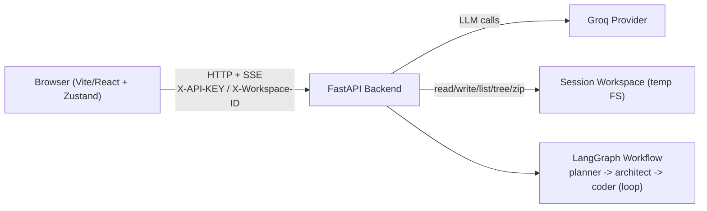

# Charito - Agentic Coding Platform

## What This Project Does
Charito is a prompt-driven agentic coding platform that generates software projects through a strict three-node workflow:

1. `planner` builds a structured implementation plan.
2. `architect` converts the plan into ordered file-level steps.
3. `coder` executes steps with workspace tools and loops until status is `DONE`.

The system exposes synchronous (`/generate`) and streaming (`/stream`) workflow APIs, plus session-scoped workspace APIs for file editing, tree inspection, and ZIP export.

## How It Works (planner -> architect -> coder)
1. Live Studio initializes or resumes a workspace session.
2. User submits a prompt and API key.
3. Backend validates input, resolves workspace, builds the configured model, and starts graph execution.
4. SSE events stream node lifecycle and progress updates.
5. Frontend store updates graph state, logs, and workspace views in real time.
6. `coder` continues iterating file tasks until completion.

## Core Capabilities
- Deterministic 3-node workflow with `coder` self-loop until `DONE`.
- Real-time SSE lifecycle events with normalized payloads.
- Session-scoped workspace CRUD with path safety and ZIP download.
- Prompt layering model: immutable global rules + immutable node prefix + mutable overrides.
- Workflow graph, logs, and file explorer orchestration in Live Studio.
- Session reset that can abort active generation safely.

## Architecture at a Glance


## Repository Structure
```text
agent/                         # Backend runtime, graph, prompts, workspace, security config
config/                        # Immutable prompt policy and node defaults
tests/                         # Backend contract and behavior tests
frontend/                      # React app, store, Live Studio, docs pages
PROJECT_COMPLETE_TECHNICAL_DOCUMENTATION.md  # Full recreation-grade technical spec
README_STITCHING.md            # Figma stitching integration contract
render.yaml                    # Render deployment blueprint
```

## Quick Start (Local Development)
If you are new, do this first:

1. Start backend.
2. Start frontend.
3. Open Studio, set API key.
4. Run a simple prompt and inspect graph/logs/files.

Backend:
```bash
python -m venv venv
venv\Scripts\activate
pip install -r requirements.txt
uvicorn agent.api:app --host 0.0.0.0 --port 8000 --reload
```

Frontend:
```bash
cd frontend
npm install
npm run dev
```

Open `http://localhost:5173/studio` and run a prompt such as:

```text
Build a minimal FastAPI app with a /health endpoint and README.
```

Need full internals? See [PROJECT_COMPLETE_TECHNICAL_DOCUMENTATION.md](./PROJECT_COMPLETE_TECHNICAL_DOCUMENTATION.md).

## Configuration
### Backend environment variables
| Variable | Purpose | Typical production value |
|---|---|---|
| `APP_ENV` | Runtime mode | `production` |
| `CORS_ALLOWED_ORIGINS` | Explicit browser allowlist (CSV) | `https://<your-vercel-domain>` |
| `CORS_ALLOW_CREDENTIALS` | CORS credentials flag | `false` |
| `REQUIRE_WORKSPACE_AUTH` | Require API key for workspace routes | `true` |
| `EXPOSE_VERBOSE_ERRORS` | Include internal exception details | `false` |

### Frontend environment variables
| Variable | Purpose | Typical production value |
|---|---|---|
| `VITE_API_BASE_URL` | Backend base URL used by API client | `https://<your-render-domain>` |

Notes:
- In local non-production runs, frontend falls back to `http://localhost:8000` if `VITE_API_BASE_URL` is not set.
- In production frontend builds, missing `VITE_API_BASE_URL` is treated as misconfiguration.

## API Quick Reference
### Core
- `GET /health`
- `GET /graph/schema`
- `GET /api/prompts`
- `GET /prompts/schema`
- `GET /v1/prompts/schema`
- `GET /v1/prompt-policy`

### Workflow
- `POST /generate`
- `POST /v1/workflows/run`
- `POST /stream`
- `POST /v1/workflows/stream`

### Workspace
- `POST /workspace/session`
- `POST /workspace/session/{workspace_id}/touch`
- `DELETE /workspace/session/{workspace_id}`
- `GET /workspace/tree`
- `GET /workspace/files`
- `GET /workspace/file`
- `PUT /workspace/file`
- `POST /workspace/folder`
- `POST /workspace/rename`
- `DELETE /workspace/path`
- `GET /workspace/download`

## Live Studio Runtime Behavior
- Graph state is workflow-node scoped (`planner`, `architect`, `coder`).
- First run in an empty workspace starts directly (`continue` mode) without rollover confirmation.
- Once artifacts exist, Run shows workspace choice modal (`continue` vs `fresh`).
- Prompt draft changes (when not running) reset graph + logs visualization.
- Reset Session aborts active generation first, then rotates workspace.
- Logs auto-follow only when user is near bottom; manual scroll-up is preserved.

## Testing and Verification
Backend:
```bash
python -m pytest -q tests
```

Frontend:
```bash
cd frontend && npm run test
cd frontend && npm run build
```

Recommended smoke checks:
1. `GET /health` returns expected env flags.
2. `/studio` can start a stream run and show node transitions.
3. Generated files appear in tree and ZIP download works.

## Deployment (Render + Vercel)
### Backend on Render
- Use `render.yaml` blueprint.
- Start command: `uvicorn agent.api:app --host 0.0.0.0 --port $PORT`.
- Health endpoint: `/health`.

### Frontend on Vercel
- Root directory: `frontend`.
- Build command: `npm run build`.
- Output directory: `dist`.
- Configure `VITE_API_BASE_URL` to Render backend URL.

### Cross-origin wiring sequence
1. Deploy backend and copy URL.
2. Set `VITE_API_BASE_URL` in Vercel and deploy frontend.
3. Set backend `CORS_ALLOWED_ORIGINS` to the exact frontend origin.
4. Redeploy backend.

## Troubleshooting
- `Network Error` in Studio:
  - check frontend is calling deployed backend URL (not localhost)
  - verify backend CORS allowlist includes exact frontend origin
  - verify HTTPS/HTTP scheme compatibility
- Workspace `401 workspace_unauthorized`:
  - provide non-empty API key when workspace auth is enabled
- `/stream` connection errors:
  - provider/network path issue; review classified `error_type` and `hint`
- Missing production API base URL:
  - set `VITE_API_BASE_URL` in deployment environment and redeploy

## Documentation Map
- [PROJECT_COMPLETE_TECHNICAL_DOCUMENTATION.md](./PROJECT_COMPLETE_TECHNICAL_DOCUMENTATION.md) - full system specification and contracts
- [README_STITCHING.md](./README_STITCHING.md) - Figma stitching integration contract
- [security_best_practices_report.md](./security_best_practices_report.md) - security review snapshot
- [frontend/guidelines/Guidelines.md](./frontend/guidelines/Guidelines.md) - frontend guidelines

## License
This project is licensed under the [MIT License](./LICENSE).
